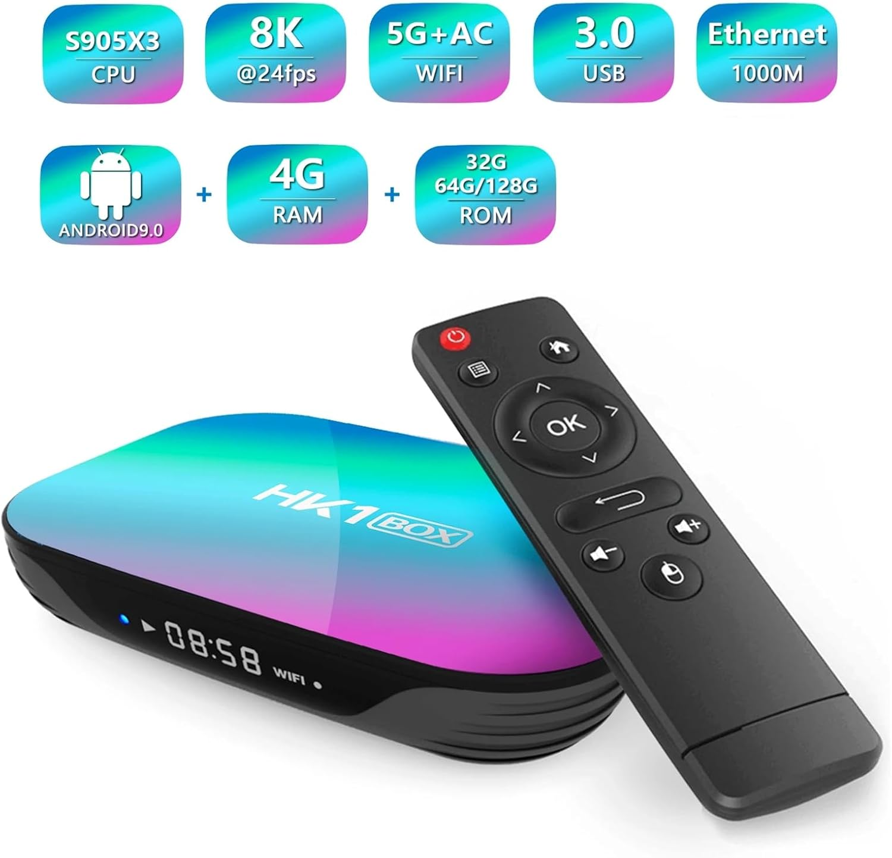
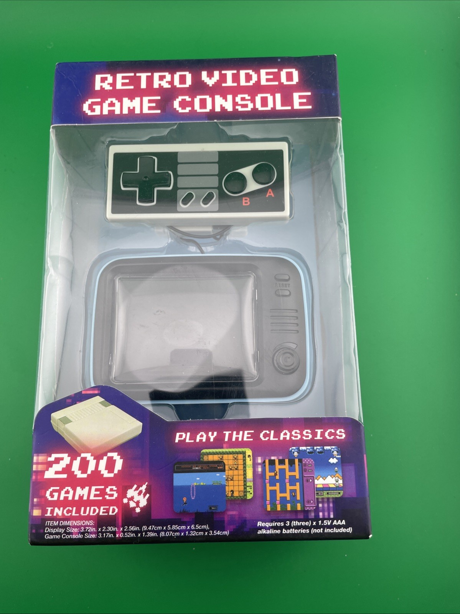
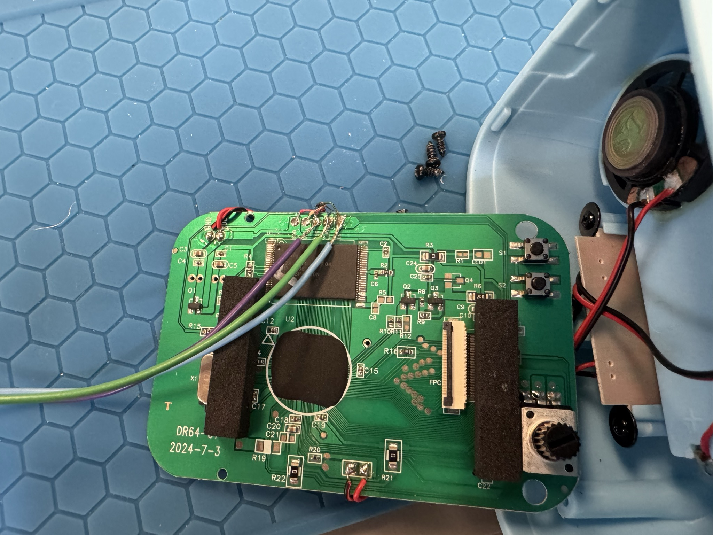
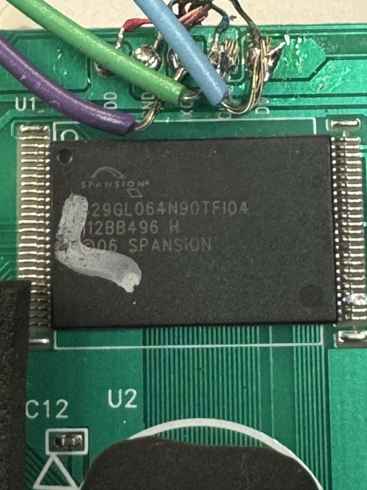
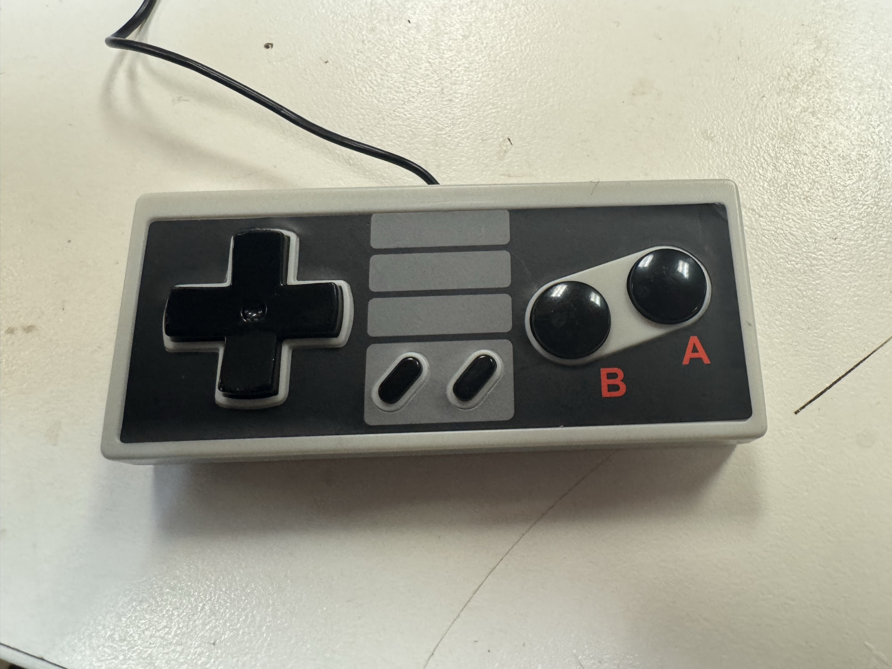
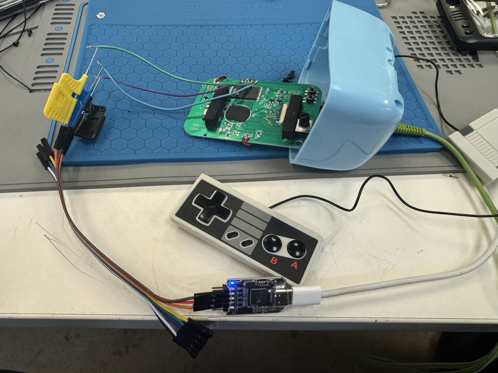

% Reverse Engineering with Logic Analyzer
% Joe <kamikazejoe@gmail.com> & Rob <robert@rtward.com>
% Talk: [${TALK_URL}](${TALK_URL}) Repo: [${REPO_URL}](${REPO_URL})

# Setting the Stage

## The Original Plan

::: notes

Joe's original plan was to show how to use the serial protocols from last month to hack this device.
Bought it years ago, because it already had known vulnerabilities and figured it would make an effective demonstration.

Turns out it was broken.  Time to pivot!

:::

## The New Plan

::: notes

After scouring around for suitable hardware, Joe found this dollar store game console.

Let's see what we can do with this.

:::

## Much disappointment

::: notes

Inside was just a glob top, a flash chip, and a display.

No visible serial interfaces on the board.

:::

## Maybe?

::: notes

Thought about trying to dump the flash chip.
But didn't want to solder those tiny leads.

:::

## Or Maybe...

::: notes

Bob said "What about the controller?"
We noticed there were only 5 wires for 8 buttons.
So there must be some kind of encoding or something going on there.

:::

# Tools Required

- Laptop
- NanoDLA Sigrok Compatible Logic Analyzer
- Pulseview Software
- Test Clips
- Screwdriver

::: notes

Some speaker notes here

:::

## QoL Tools

- Multi-meter
- Soldering Iron
- Thin Threaded Wire

::: notes

Some speaker notes here

:::

# Make Like Johnny 5...

Dissassemble!

::: notes

Some speaker notes here

:::

## Note Labels

- D0
- CLK
- XCK
- GND
- VDD

::: notes

We can pretty much disregard the GND and VDD here.
Two clock lines and one digital out is interesting though

:::

## Solder some leads.

::: notes

This is optional, but it will defintiely make your life easier.

:::

## Wire up the Logic Analyzer

::: notes

Doesn't really matter which is which.  Just make note.

:::

# Pulseview

::: notes

Some speaker notes here

:::

## Configure Lables

::: notes

Some speaker notes here

:::

## Select Sample Rate

::: notes

Ideally you want it set to 10 times the recorded frequency/bandwidth
Sometimes that's not practicle.  In that case, 4 times will do.

Too low and you may not capture everything, or get more interference from noise.

:::

## Select Number of Samples

::: notes

The more the better.

At least enough to capture enough identifying data, which can be tricky if you don't know what you are dealing with. 

Though this eats up RAM very quickly.

I recommend 10-20 times your sample rate

:::

## Record Samples

::: notes

Start recording your samples

We the push each button on the controller.

And then push a few together to see what happens.

:::

# Reviewing Results

::: notes

You can clearly see the clock signals.
And signal on the data line when we pressed buttons.

:::

## Zoom in.

::: notes

Some speaker notes here

:::

## Keep zooming.

::: notes

Some speaker notes here

:::

## There you go.

::: notes

We can finally see what we are dealing with.

:::

# Going Through Button Signals

::: notes

Let's review the signals for each button press

:::

## A Button

::: notes

Some speaker notes here

:::

## B Button

::: notes

Some speaker notes here

:::

## Start Button

::: notes

Some speaker notes here

:::

## Select Button

::: notes

Some speaker notes here

:::

## Up Button

::: notes

Some speaker notes here

:::

## Down Button

::: notes

Some speaker notes here

:::

## Left Button

::: notes

Some speaker notes here

:::

## Right Button

::: notes

Some speaker notes here

:::

## B and Right Together

::: notes

Some speaker notes here

:::

## First Page

- My
- Talk
- Outline

## Content Page

Some important info

::: notes

Some speaker notes here

:::

# Next Big Section

## Content Page 2

An important image

# The End

---

Joe <kamikazejoe@gmail.com> & Rob <robert@rtward.com>

Talk: [${TALK_URL}](${TALK_URL})

Repo: [${REPO_URL}](${REPO_URL})
